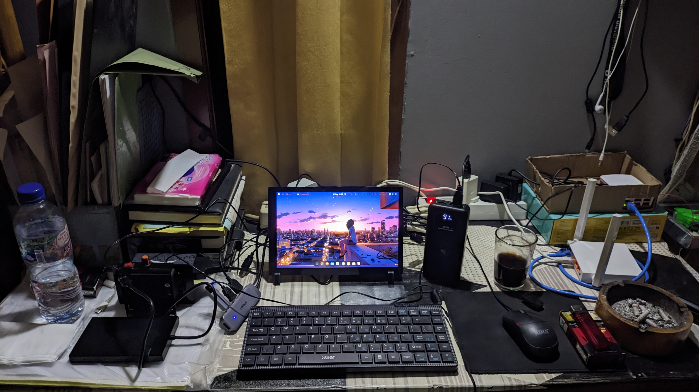

# 🏰 Digital Independence



Kumpulan konfigurasi Docker Compose untuk menjalankan berbagai layanan self-hosted di mesin sendiri. Repositori ini dibuat untuk membantu siapa saja yang ingin mencoba mengelola data dan aplikasi pribadinya secara mandiri — bukan karena harus lepas total dari platform komersial, tapi karena ingin punya pilihan.

## ✨ Layanan yang Tersedia

| Ikon | Nama Layanan | Path Direktori | Deskripsi Singkat |
|------|---------------|----------------|-------------------|
| 📊 | **Dashdot** | `dashdot/` | Menampilkan informasi sistem melalui antarmuka web. |
| 💬 | **Element Web** | `element-web/` | Klien web untuk Matrix, mendukung komunikasi terenkripsi. |
| 🗂️ | **Homarr** | `homarr/` | Dasbor beranda yang bisa menampung berbagai widget. |
| 🖼️ | **Immich** | `immich-app/` | Pengelola foto dan video yang bisa di-host sendiri. |
| 🎥 | **Jellyfin** | `jellyfin/` | Server media untuk streaming film, musik, dan acara TV. |
| 🌐 | **LibreTranslate** | `LibreTranslate/` | Mesin penerjemah yang bisa dijalankan secara lokal. |
| ☁️ | **Nextcloud** | `nextcrow-docker/` | Platform penyimpanan awan dan kolaborasi dokumen. |
| 🔔 | **ntfy** | `ntfy/` | Layanan notifikasi push sederhana lewat HTTP. |
| 🤖 | **Open WebUI** | `open-webui/` | Antarmuka web untuk model bahasa besar (LLM) lokal, kompatibel dengan Ollama dan API OpenAI. |
| 🛡️ | **Pi-hole** | `pi-hole/` | Pemblokir iklan dan pelacak di tingkat DNS satu jaringan. |
| 🐳 | **Portainer** | `portainer/` | Panel manajemen kontainer Docker berbasis web. |
| 🔍 | **SearXNG** | `searxng-docker/` | Metasearch engine yang tidak melacak pengguna. |
| 📨 | **Synapse** | `synapse/` | Server Matrix untuk komunikasi terdesentralisasi. |
| ⏱️ | **Uptime Kuma** | `uptime-kuma/` | Pemantau status dan ketersediaan layanan. |
| 🔐 | **Vaultwarden** | `vaultwarden/` | Pengelola kata sandi, kompatibel dengan aplikasi Bitwarden. |
| 📚 | **MediaWiki** | `wiki/` | Mesin wiki, perangkat lunak yang digunakan Wikipedia. |
| 🔗 | **YOURLS** | `yourls/` | Pemendek tautan yang bisa di-host sendiri. |

Synapse juga dilengkapi sub-layanan:
- `synapse:mautrix-telegram` – Penghubung ke Telegram
- `synapse:mautrix-whatsapp` – Penghubung ke WhatsApp

## 📋 Prasyarat

- **Docker Engine** (versi 29.4 ke atas disarankan)
- **Git**
- (Opsional) `whiptail` atau `dialog` untuk menu interaktif
- Sistem operasi Linux/macOS (Windows dengan WSL2 juga bisa digunakan)

## 🚀 Memulai

1. Kloning repositori:
   ```bash
   cd ~/
   git clone https://github.com/ricalnet/digital-independence.git
   cd digital-independence
   ```

2. Instalasi Docker Engine (jika belum terpasang):
   - Untuk Debian:
     ```bash
     ./install-docker-engine-on-debian.sh
     ```
   - Untuk Ubuntu:
     ```bash
     ./install-docker-engine-on-ubuntu.sh
     ```

3. Beberapa layanan membutuhkan file `.env`. Salin dari template yang tersedia:
   ```bash
   # Contoh untuk Immich
   cp immich-app/.env.example immich-app/.env
   # Sesuaikan isinya
   nano immich-app/.env
   ```
   Lakukan langkah yang sama untuk setiap layanan yang ingin dijalankan.

4. Gunakan `sovereign.sh` untuk menjalankan dan mengelola layanan.

## ⚙️ Cara Pakai `sovereign.sh`

Skrip ini adalah alat bantu untuk mengelola layanan-layanan yang ada. Dirancang agar bisa digunakan dengan satu perintah.

### 📊 Menu Interaktif

```bash
./sovereign.sh -i
```
Atau langsung jalankan `./sovereign.sh` tanpa argumen.

<details>
<summary>📘 Panduan lengkap: <code>./sovereign.sh -h</code></summary>

```bash
./sovereign.sh -h
Digital Independence by Ricalnet
SOVEREIGN.SH v2.0.0

USAGE:
    ./sovereign.sh [OPTIONS] [ACTION] [SERVICE...]

OPTIONS:
    -h, --help              Show this help message
    -l, --list              List all available services
    -a, --all               Run action on all services
    -d, --down              Stop and remove containers (ACTION)
    -r, --restart           Restart services (ACTION)
    -p, --pull              Pull latest images before action
    -b, --build             Build images before action
    -v, --verbose           Show detailed output
    -i, --interactive       Interactive checkbox menu
    -n, --dry-run           Show what would be executed (no changes)
    -s, --sudo              Use sudo for docker commands
    --no-color              Disable colored output

ACTIONS:
    up                      Start services (default)
    down                    Stop and remove services
    restart                 Restart services
    logs                    Show logs (last 50 lines)
    ps                      Show container status
    prune                   Clean up unused resources

COMBINED ACTIONS:
    recycle                 PULL → DOWN → UP (full refresh with new images)
    update                  PULL → UP (update without downtime)
    fresh                   DOWN → UP (recreate without pull)

EXAMPLES:
    ./sovereign.sh portainer                                    # Start portainer
    ./sovereign.sh -a up                                        # Start all services
    ./sovereign.sh -d portainer                                 # Stop portainer
    ./sovereign.sh -r portainer vaultwarden                     # Restart services
    ./sovereign.sh --pull --all up                              # Update all services
    ./sovereign.sh recycle synapse                              # Full refresh synapse
    ./sovereign.sh recycle synapse synapse:mautrix-telegram     # Refresh synapse + bridges
    ./sovereign.sh fresh immich                                 # Recreate immich only
    ./sovereign.sh -n up portainer                              # Dry run
    ./sovereign.sh -i                                           # Interactive mode

SERVICE NAMING:
    • Main services: use service name directly
    • Synapse sub-services: synapse:mautrix-telegram, synapse:mautrix-whatsapp

RECYCLE SEQUENCE:
    1. PULL  → Download latest images (container still running)
    2. DOWN  → Stop and remove old container
    3. UP    → Start new container with fresh image and config
```
</details>

## ⚠️ Hal yang Perlu Diperhatikan

- Kata sandi bawaan dan kunci rahasia di file `.env` sebaiknya segera diubah setelah instalasi.
- Data kontainer biasanya disimpan di direktori lokal atau Docker volume. Pertimbangkan untuk melakukan pencadangan secara berkala.
- Untuk mengakses layanan dari internet, bisa menggunakan reverse proxy seperti Nginx Proxy Manager atau Traefik (tidak termasuk dalam repositori ini — perlu dikonfigurasi terpisah).
- Gunakan flag `--pull` sesekali untuk memperbarui image, dan sempatkan membaca changelog proyek upstream bila ada perubahan besar.

## 🤝 Kontribusi

Masukan, perbaikan, dan tambahan selalu diterima. Beberapa hal yang bisa dikontribusikan:
- Menambahkan konfigurasi untuk layanan baru.
- Memperbaiki bug atau meningkatkan fitur di `sovereign.sh`.
- Melengkapi atau merapikan dokumentasi.

Silakan buka [Issue](https://github.com/ricalnet/digital-independence/issues) atau kirim [Pull Request](https://github.com/ricalnet/digital-independence/pulls).

## 📜 Lisensi

Repositori ini menggunakan [Lisensi MIT](LICENSE). Setiap layanan yang ada di dalamnya memiliki lisensi masing-masing — pastikan untuk mengikuti ketentuan lisensi tersebut.