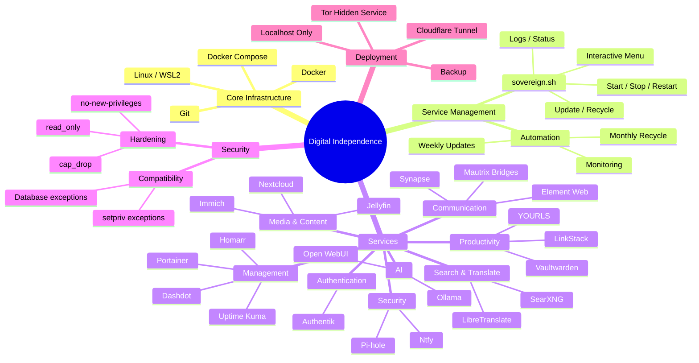

<div align="center">

# Digital Independence


```mermaid
mindmap
  root((Digital Independence))
    Core Infrastructure
      Docker
      Docker Compose
      Git
      Linux / WSL2
    Service Management
      sovereign.sh
        Interactive Menu
        Start / Stop / Restart
        Update / Recycle
        Logs / Status
      Automation
        Weekly Updates
        Monthly Recycle
        Monitoring
    Services
      Authentication
        Authentik
      Communication
        Element Web
        Synapse
        Mautrix Bridges
      Media & Content
        Jellyfin
        Immich
        Nextcloud
      Productivity
        Vaultwarden
        LinkStack
        YOURLS
      Search & Translate
        SearXNG
        LibreTranslate
      Security
        Pi-hole
        Ntfy
      AI
        Open WebUI
        Ollama
      Management
        Portainer
        Uptime Kuma
        Dashdot
        Homarr
    Security
      Hardening
        no-new-privileges
        cap_drop
        read_only
      Compatibility
        Database exceptions
        setpriv exceptions
    Deployment
      Localhost Only
      Tor Hidden Service
      Cloudflare Tunnel
      Backup
```

**Take back control of your digital life, one container at a time.**

[](https://opensource.org/licenses/MIT)
[](https://www.docker.com/)
[](https://hub.docker.com/)
[](https://github.com/ricalnet/digital-independence/issues)
[](https://www.gnu.org/software/bash/)
[](https://github.com/ricalnet/digital-independence/graphs/commit-activity)

</div>

## 📌 Overview

Digital Independence is a collection of ready-to-use Docker Compose configurations for running various self-hosted services on your own infrastructure. This project empowers individuals and small organizations to:

- 📊 Eliminate third-party access and data mining
- 🔒 Keep everything within your infrastructure
- 🔄 Enjoy freedom to switch, modify, or replace services
- 💰 Eliminate recurring subscription fees
- 🎯 Build valuable DevOps and system administration skills

## 🏗️ Architecture Support

All services in this repository are built and tested for two major CPU architectures out of the box:

| Architecture | Platforms / Devices | Status |
|--------------|----------------------|--------|
| `linux/amd64` | Intel/AMD desktops, servers, VPS (x86_64) | ✅ Fully Supported |
| `linux/arm64` | Raspberry Pi 4/5, Apple M1/M2/M3, AWS Graviton, ARM-based servers | ✅ Fully Supported |

While the repository has not been tested on 32-bit ARM (`arm/v7`) for all services (as some heavier apps require 64-bit), the entire catalog is 100% compatible with both `amd64` and `arm64`.

## ✨ Available Services

### 🔐 Security

| Icon | Service | Directory | Port | .env Required | Status |
|------|---------|-----------|------|---------------|--------|
| 🛡️ | **Wazuh** | `wazuh/` | 443 | ✅ Yes | Stable |
| 🛡️ | **Pi-hole** | `pi-hole/` | 53, 8080 | ✅ Yes | Stable |
| 🔐 | **Vaultwarden** | `vaultwarden/` | 8000 | ✅ Yes | Stable |
| 🔑 | **Authentik** | `authentik/` | 9000, 9443 | ✅ Yes | Stable |

### 🤖 AI

| Icon | Service | Directory | Port | .env Required | Status |
|------|---------|-----------|------|---------------|--------|
| 🤖 | **Open WebUI + Ollama** | `open-webui/` | 3000 | ✅ Yes | Stable |

### 🖥️ Management & Monitoring

| Icon | Service | Directory | Port | .env Required | Status |
|------|---------|-----------|------|---------------|--------|
| 📊 | **Dashdot** | `dashdot/` | 3001 | ❌ No | Stable |
| 🗂️ | **Homarr** | `homarr/` | 7575 | ✅ Yes | Stable |
| 🔔 | **ntfy** | `ntfy/` | 8010 | ✅ Yes | Stable |
| ⏱️ | **Uptime Kuma** | `uptime-kuma/` | 9442 | ❌ No | Stable |
| 🐳 | **Portainer** | `portainer/` | 9443 | ❌ No | Stable |

### 💬 Communication (Matrix)

| Icon | Service | Directory | Port | .env Required | Status |
|------|---------|-----------|------|---------------|--------|
| 📨 | **Synapse** | `synapse/` | 8008, 8448 | ✅ Yes | Stable |
| 💬 | **Element Web** | `element-web/` | 8009 | ❌ No | Stable |
| 📨 | **Mautrix-Telegram** | `synapse/mautrix-telegram/` | - | ❌ No | Stable |
| 📨 | **Mautrix-WhatsApp** | `synapse/mautrix-whatsapp/` | - | ✅ Yes | Stable |

### 🌐 Search & Translate

| Icon | Service | Directory | Port | .env Required | Status |
|------|---------|-----------|------|---------------|--------|
| 🌐 | **LibreTranslate** | `libretranslate/` | 5001 | ❌ No | Stable |
| 🔍 | **SearXNG** | `searxng/` | 8888 | ✅ Yes | Stable |

### 📁 Media & Content

| Icon | Service | Directory | Port | .env Required | Status |
|------|---------|-----------|------|---------------|--------|
| 🖼️ | **Immich** | `immich-app/` | 2283 | ✅ Yes | Stable |
| 🎵 | **Navidrome** | `navidrome/` | 4533 | ❌ No | Stable |
| ☁️ | **Nextcloud** | `nextcloud/` | 5000 | ✅ Yes | Stable |
| 🎥 | **Jellyfin** | `jellyfin/` | 8096, 8920 | ❌ No | Stable |

### 🔗 Link Management

| Icon | Service | Directory | Port | .env Required | Status |
|------|---------|-----------|------|---------------|--------|
| 🔗 | **YOURLS** | `yourls/` | 8001 | ✅ Yes | Stable |
| 🔗 | **LinkStack** | `linkstack/` | 8003 | ✅ Yes | Stable |

### 📚 Knowledge & Publishing
| Icon | Service | Directory | Port | .env Required | Status |
|------|---------|-----------|------|---------------|--------|
| 📚 | **MediaWiki** | `wiki/` | 8002 | ✅ Yes | Stable |

### 🐘 Social Media

| Icon | Service | Directory | Port | .env Required | Status |
|------|---------|-----------|------|---------------|--------|
| 🐘 | **Mastodon** | `mastodon/` | 4000, 4001 | ✅ Yes (2 files)* | Stable |

> Mastodon requires both `.env` (for Docker) and `.env.production` (for Mastodon configuration)

> Ports listed are the default ports on the host. Some services are only bound to `127.0.0.1` (localhost) for security reasons. Modify the configuration in each service's `docker-compose.yml` to bind to `0.0.0.0` or change the port.

### Additional Synapse Services (Bridges)

- `synapse:mautrix-telegram` – Telegram bridge (no .env, uses config.yaml)
- `synapse:mautrix-whatsapp` – WhatsApp bridge (requires .env for DB credentials)

> These bridges are located in `synapse/mautrix-telegram/` and `synapse/mautrix-whatsapp/` directories. They share the same `matrix-network` as Synapse.

## 📋 Prerequisites

Before starting, ensure your system meets the following requirements:

| Requirement | Minimum Version | Notes |
|-------------|----------------|-------|
| Docker Engine | 29.4+ | Required for all container operations |
| Docker Compose | v2.0+ | Included with Docker Engine 29.4+ |
| Git | Latest | For cloning the repository |
| Operating System | Linux / macOS / WSL2 | Windows WSL2 recommended |
| `curl` or `wget` | Latest | For healthchecks and downloads |

### Optional Dependencies

- `whiptail` or `dialog` – For interactive menu in `sovereign.sh`
- `jq` – For JSON parsing in automation scripts

## 🚀 Getting Started

### 1. Clone the Repository

```bash
cd ~/
git clone https://github.com/ricalnet/digital-independence.git
cd digital-independence
```

### 2. Install Docker Engine

If Docker is not already installed, use the provided installation scripts:

For Debian:
```bash
./install-docker-engine-on-debian.sh
```

For Ubuntu:
```bash
./install-docker-engine-on-ubuntu.sh
```

### 3. Prepare Environment Files

Some services require `.env` configuration files. Each service that needs a `.env` includes an `.env.example` template:

```bash
# Example for Authentik
cp authentik/.env.example authentik/.env
nano authentik/.env   # adjust as needed

# Example for Immich
cp immich-app/.env.example immich-app/.env
nano immich-app/.env   # adjust as needed
```

Quick Password Generator:
```bash
# Generate a secure password
openssl rand -base64 32

# Generate multiple passwords at once
for i in {1..5}; do openssl rand -base64 32; done
```

### 4. Create External Networks

Some services require pre-created networks:

```bash
# For Synapse and Mautrix bridges
docker network create matrix-network
```

### 5. Manage Services

Use the `sovereign.sh` script to start, stop, and manage all services (see next section).

## ⚙️ Using `sovereign.sh`

`sovereign.sh` is a powerful command-line tool designed to simplify management of all services in one command.

### Interactive Menu (Easiest for Beginners)

```bash
./sovereign.sh -i
```

Or simply run without arguments:

```bash
./sovereign.sh
```

### Quick Command Examples

| Purpose | Command |
|---------|---------|
| Start a single service | `./sovereign.sh portainer` |
| Start all services | `./sovereign.sh -a up` |
| Stop a service | `./sovereign.sh -d portainer` |
| Restart services | `./sovereign.sh -r portainer vaultwarden` |
| Update images and restart | `./sovereign.sh recycle synapse` |
| Update without downtime | `./sovereign.sh update immich` |
| Simulate commands (dry-run) | `./sovereign.sh -n up portainer` |
| View service logs | `./sovereign.sh logs portainer` |
| Check service status | `./sovereign.sh ps` |

> For Synapse sub-services, use `synapse:mautrix-telegram` or `synapse:mautrix-whatsapp`.

### Full Help Guide

```bash
./sovereign.sh -h
```

<details>
<summary>📘 Click to expand full help guide</summary>

```bash
Digital Independence by Ricalnet
SOVEREIGN.SH v2.0.0

USAGE:
    ./sovereign.sh [OPTIONS] [ACTION] [SERVICE...]

OPTIONS:
    -h, --help              Show this help message
    -l, --list              List all available services
    -a, --all               Run action on all services
    -d, --down              Stop and remove containers (ACTION)
    -r, --restart           Restart services (ACTION)
    -p, --pull              Pull latest images before action
    -b, --build             Build images before action
    -v, --verbose           Show detailed output
    -i, --interactive       Interactive checkbox menu
    -n, --dry-run           Show what would be executed (no changes)
    -s, --sudo              Use sudo for docker commands
    --no-color              Disable colored output

ACTIONS:
    up                      Start services (default)
    down                    Stop and remove services
    restart                 Restart services
    logs                    Show logs (last 50 lines)
    ps                      Show container status
    prune                   Clean up unused resources

COMBINED ACTIONS:
    recycle                 PULL → DOWN → UP (full refresh with new images)
    update                  PULL → UP (update without downtime)
    fresh                   DOWN → UP (recreate without pull)

EXAMPLES:
    ./sovereign.sh portainer                                    # Start portainer
    ./sovereign.sh -a up                                        # Start all services
    ./sovereign.sh -d portainer                                 # Stop portainer
    ./sovereign.sh -r portainer vaultwarden                     # Restart services
    ./sovereign.sh --pull --all up                              # Update all services
    ./sovereign.sh recycle synapse                              # Full refresh synapse
    ./sovereign.sh recycle synapse synapse:mautrix-telegram     # Refresh synapse + bridges
    ./sovereign.sh fresh immich                                 # Recreate immich only
    ./sovereign.sh -n up portainer                              # Dry run
    ./sovereign.sh -i                                           # Interactive mode

SERVICE NAMING:
    • Main services: use service name directly
    • Synapse sub-services: synapse:mautrix-telegram, synapse:mautrix-whatsapp

RECYCLE SEQUENCE:
    1. PULL  → Download latest images (container still running)
    2. DOWN  → Stop and remove old container
    3. UP    → Start new container with fresh image and config
```
</details>

## 🌐 Exposing Services to the Internet

By default, services are only accessible from localhost. To access them securely from the internet, this repository supports two approaches:

### 🧅 Tor Hidden Service (.onion)

Anonymous access through the Tor network, ideal for maximum privacy.

- 📖 [Tor Hidden Service Implementation Guide](https://docs.ricalnet.my.id/posts/panduan-implementasi-hidden-service-tor/)
- Benefits: No need for domain names, true anonymity, resistant to censorship

### ☁️ Cloudflare Tunnel

Access through Cloudflare without opening firewall ports.

- 📖 [Cloudflare Tunnel Configuration Guide](https://docs.ricalnet.my.id/posts/panduan-lengkap-mengonfigurasi-cloudflare-tunnel-untuk-ekspos-layanan-lokal/)
- Benefits: DDoS protection, built-in SSL, no public IP required

## 🔒 Security & Maintenance Guidelines

To keep your system secure and stable, follow these recommendations:

### Initial Setup

- 🔑 Change all default passwords immediately in `.env` files
- 🔒 Use strong, unique secrets for each service
- 🌐 Bind to localhost (127.0.0.1) unless you need external access
- 📁 Set proper file permissions: `chmod 600 .env` for sensitive files

### Ongoing Maintenance

- 📦 Container data is stored in local directories or Docker volumes
- ⬆️ Use `--pull` option to get security patches and updates
- 📰 Read upstream changelogs before major version upgrades
- 🔍 Monitor logs for suspicious activity: `./sovereign.sh logs [service]`
- 📊 Enable health checks and monitoring with Uptime Kuma

## 💾 Backup & Recovery

Protect your data with a robust backup solution using [Chantik](https://github.com/ricalnet/chantik) – a ChaCha20-Authenticated Backup Protection tool designed specifically for Docker environments.

## 🤖 Automation Scripts

This repository includes automation scripts for scheduled maintenance. The scripts are located in `automation-scripts/` and can be configured via cron jobs.

### 📅 Weekly Updates

Automatically pulls latest images and updates services without downtime.

```bash
# Copy and configure the config file
cp automation-scripts/weekly-updates/weekly_updates.conf.example automation-scripts/weekly-updates/weekly_updates.conf
nano automation-scripts/weekly-updates/weekly_updates.conf
```

### 🔄 Monthly Recycle

Performs a full refresh (pull → down → up) on selected services to ensure fresh containers.

```bash
# Copy and configure the config file
cp automation-scripts/monthly-recycle/monthly_recycle.conf.example automation-scripts/monthly-recycle/monthly_recycle.conf
nano automation-scripts/monthly-recycle/monthly_recycle.conf
```

### ⏰ Setting Up Cron Jobs

Add these entries to your crontab for automated maintenance:

```bash
sudo crontab -e
```

```bash
# Weekly updates - every Sunday at 3 AM
0 3 * * 0 /path/to/digital-independence/automation-scripts/weekly-updates/weekly_updates.sh

# Monthly recycle - every 1st day of the month at 6 AM
0 6 1 * * /path/to/digital-independence/automation-scripts/monthly-recycle/monthly_recycle.sh
```

> Replace `/path/to/digital-independence/` with the actual path where you cloned the repository.

### Script Configuration

| Script | Config File | Purpose |
|--------|-------------|---------|
| `weekly_updates.sh` | `weekly_updates.conf` | List of services to update weekly |
| `monthly_recycle.sh` | `monthly_recycle.conf` | List of services to recycle monthly |

The scripts automatically log their output to `logs/` directory for monitoring and troubleshooting.

## 🤝 Contributing

Here are some areas where you can help:

- Adding configurations for new services
- Fixing bugs or improving features in `sovereign.sh`
- Completing or improving documentation
- Testing on different platforms (ARM, x86, etc.)

Please open an [Issue](https://github.com/ricalnet/digital-independence/issues) or submit a [Pull Request](https://github.com/ricalnet/digital-independence/pulls).

## 📜 License

### Repository License

This repository is licensed under the MIT License – see the [LICENSE](LICENSE) file for details.

### Upstream Project Licenses

Each service included in this repository is a separate open-source project with its own license. Please review and comply with the license terms of each upstream project before using them in production.

| Service | License |
|---------|---------|
| Authentik | [LICENSE](https://github.com/goauthentik/authentik/blob/main/LICENSE) |
| Dashdot | [LICENSE](https://github.com/MauriceNino/dashdot/blob/main/LICENSE.md) |
| Element Web | [LICENSE](https://github.com/element-hq/element-web/blob/develop/LICENSE-AGPL-3.0) |
| Homarr | [LICENSE](https://github.com/homarr-labs/homarr/blob/dev/LICENSE) |
| Immich | [LICENSE](https://github.com/immich-app/immich/blob/main/LICENSE) |
| Jellyfin | [LICENSE](https://github.com/jellyfin/jellyfin/blob/master/LICENSE) |
| LibreTranslate | [LICENSE](https://github.com/LibreTranslate/LibreTranslate/blob/main/LICENSE) |
| LinkStack | [LICENSE](https://github.com/LinkStackOrg/LinkStack/blob/main/LICENSE) |
| Mastodon | [LICENSE](https://github.com/mastodon/mastodon/blob/main/LICENSE) |
| Mautrix-Telegram | [LICENSE](https://github.com/mautrix/telegram/blob/main/LICENSE) |
| Mautrix-WhatsApp | [LICENSE](https://github.com/mautrix/whatsapp/blob/main/LICENSE) |
| MediaWiki | [LICENSE](https://github.com/wikimedia/mediawiki?tab=License-1-ov-file) |
| Navidrome | [LICENSE](https://github.com/navidrome/navidrome/blob/master/LICENSE) |
| Nextcloud | [LICENSE](https://github.com/nextcloud/server/tree/master/LICENSES) |
| ntfy | [LICENSE](https://github.com/binwiederhier/ntfy/blob/main/LICENSE) |
| Open WebUI | [LICENSE](https://github.com/open-webui/open-webui/blob/main/LICENSE) |
| Ollama | [LICENSE](https://github.com/ollama/ollama/blob/main/LICENSE) |
| Pi-hole | [LICENSE](https://github.com/pi-hole/pi-hole/blob/master/LICENSE) |
| Portainer | [LICENSE](https://github.com/portainer/portainer/blob/develop/LICENSE) |
| SearXNG | [LICENSE](https://github.com/searxng/searxng/blob/master/LICENSE) |
| Synapse | [LICENSE](https://github.com/element-hq/synapse/blob/develop/LICENSE-AGPL-3.0) |
| Uptime Kuma | [LICENSE](https://github.com/louislam/uptime-kuma/blob/master/LICENSE) |
| Vaultwarden | [LICENSE](https://github.com/dani-garcia/vaultwarden/blob/main/LICENSE.txt) |
| Wazuh | [LICENSE](https://github.com/wazuh/wazuh-docker/blob/main/LICENSE) |
| YOURLS | [LICENSE](https://github.com/YOURLS/YOURLS/blob/master/LICENSE) |